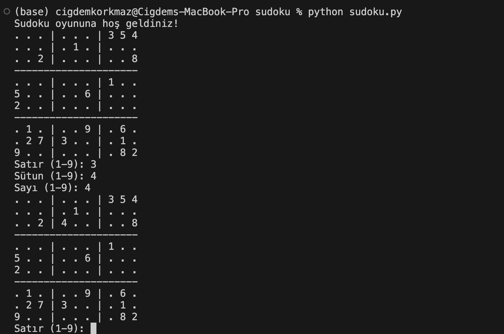

Sudoku Oyunu
1. Proje İsmi
Sudoku Oyunu

2. Proje Motivasyonu
Sudoku, hem eğlenceli hem de zihinsel gelişime katkı sağlayan bir bulmaca oyunudur. Bu projeyi seçmemizin nedeni, hem algoritmik bir problem çözme süreci sunması hem de kullanıcı etkileşimli bir uygulama geliştirme deneyimi sağlamasıdır. Bu projenin özgünlüğü, rastgele oluşturulan Sudoku tahtalarının her oyunda farklı bir deneyim sunması ve kullanıcı hamlelerinin gerçek zamanlı doğrulamasıdır.

3. Proje Amacı
Amaç: Kullanıcının Sudoku tahtasını doğru bir şekilde tamamlamasıdır.
Nasıl Kazanılır: Tüm hücreler doğru sayılarla doldurulduğunda oyun tamamlanır.
Neler Yapılabilir:
Kullanıcı, boş hücrelere 1-9 arasında sayı girebilir.
Neler Yapılamaz:
Dolu hücrelere yeniden sayı girmek.
Sudoku kurallarına (satır, sütun ve 3x3 kutular) aykırı hamleler yapmak.
Girdiler:
Kullanıcıdan satır, sütun ve sayı bilgisi alınır.
Çıktılar:
Güncellenmiş Sudoku tahtası ekrana yazdırılır.
Hatalı hamlelerde açıklayıcı uyarılar gösterilir.

4. Proje Kodu

import random

# 9x9 boş bir Sudoku tahtası
sudoku_board = [
    [0, 0, 0, 0, 0, 0, 0, 0, 0],
    [0, 0, 0, 0, 0, 0, 0, 0, 0],
    [0, 0, 0, 0, 0, 0, 0, 0, 0],
    [0, 0, 0, 0, 0, 0, 0, 0, 0],
    [0, 0, 0, 0, 0, 0, 0, 0, 0],
    [0, 0, 0, 0, 0, 0, 0, 0, 0],
    [0, 0, 0, 0, 0, 0, 0, 0, 0],
    [0, 0, 0, 0, 0, 0, 0, 0, 0],
    [0, 0, 0, 0, 0, 0, 0, 0, 0],
]

def print_board(board):
    for row in range(9):
        if row % 3 == 0 and row != 0:
            print("-" * 21)
        for col in range(9):
            if col % 3 == 0 and col != 0:
                print("| ", end="")
            print(board[row][col] if board[row][col] != 0 else ".", end=" ")
        print()

def is_valid_move(board, row, col, num):
    if num in board[row]:
        return False
    for i in range(9):
        if board[i][col] == num:
            return False
    box_row = (row // 3) * 3
    box_col = (col // 3) * 3
    for i in range(3):
        for j in range(3):
            if board[box_row + i][box_col + j] == num:
                return False
    return True

def fill_board(board):
    num_filled = 0
    while num_filled < 20:
        row = random.randint(0, 8)
        col = random.randint(0, 8)
        num = random.randint(1, 9)
        if board[row][col] == 0 and is_valid_move(board, row, col, num):
            board[row][col] = num
            num_filled += 1

def play_sudoku():
    fill_board(sudoku_board)
    print("Sudoku oyununa hoş geldiniz!")
    print_board(sudoku_board)

    while True:
        try:
            row = int(input("Satır (1-9): ")) - 1
            col = int(input("Sütun (1-9): ")) - 1
            num = int(input("Sayı (1-9): "))

            if sudoku_board[row][col] != 0:
                print("Bu hücre zaten dolu! Başka bir hücre seçin.")
                continue

            if is_valid_move(sudoku_board, row, col, num):
                sudoku_board[row][col] = num
                print_board(sudoku_board)
                if all(all(cell != 0 for cell in row) for row in sudoku_board):
                    print("Tebrikler! Sudoku'yu tamamladınız!")
                    break
            else:
                print("Geçersiz hareket! Tekrar deneyin.")
        except ValueError:
            print("Geçersiz giriş. Lütfen 1-9 arasında bir sayı girin.")

# Oyunu başlat
play_sudoku()

5. Projenin Çalışır Hali
Proje, çalıştırıldığında şu özellikleri sunar:

20 sayı rastgele yerleştirilmiş bir Sudoku tahtası oluşturulur.
Kullanıcı hamlelerine göre dinamik olarak güncellenen bir tahta görüntülenir.
Kullanıcı oyunu doğru şekilde tamamladığında "Tebrikler!" mesajı görüntülenir.

6. Karşılaşılan Zorluklar
Rastgele sayılar yerleştirirken doğruluk kontrolü: Bu problemi çözmek için is_valid_move fonksiyonu geliştirildi.
Kullanıcı hatalı giriş yaptığında hata yönetimi: Sayısal olmayan girişleri ele almak için try-except blokları kullanıldı.

7. Projeyi Yaparken Neler Öğrendiniz?
Çok boyutlu listelerle çalışma.
Kullanıcı girişleri doğrulama ve hata yönetimi.
Sudoku kurallarının algoritmalara dönüştürülmesi.

8. Projeyi Geliştirmek İçin Planınız Var mı?
Zorluk Seviyeleri: Farklı zorluk seviyeleri eklenebilir.
Görsel Arayüz: Konsol yerine grafik kullanıcı arayüzü (GUI) eklemek.
Otomatik Çözüm Kontrolü: Sudoku’nun tamamlandığında otomatik doğrulama yapılması.

9. Yorum
Bu proje sayesinde algoritmik düşünme becerilerimizi geliştirdik. Kurs içerikleri projeyi tamamlamak için yeterli rehberlik sağladı. Daha fazla zaman olsaydı, görsel bir arayüz ekleyebilirdik.